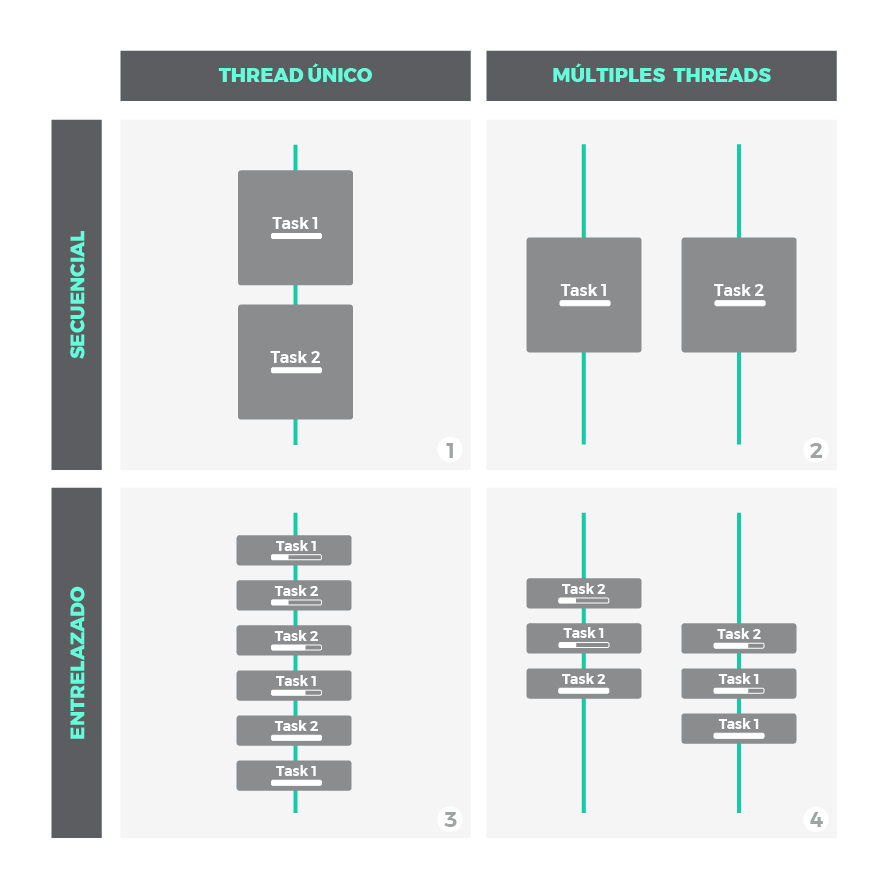
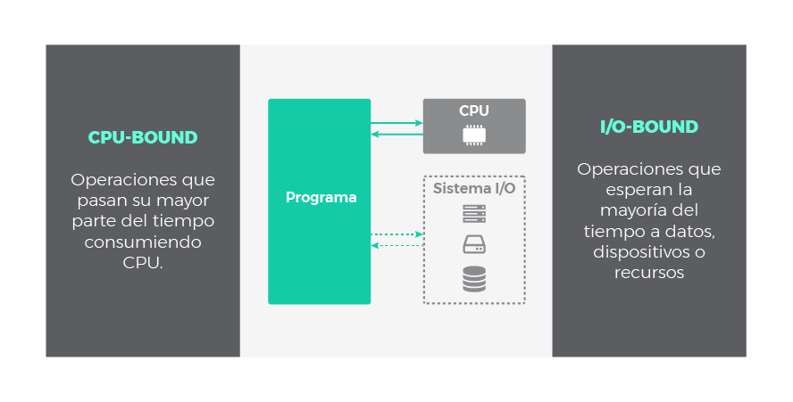
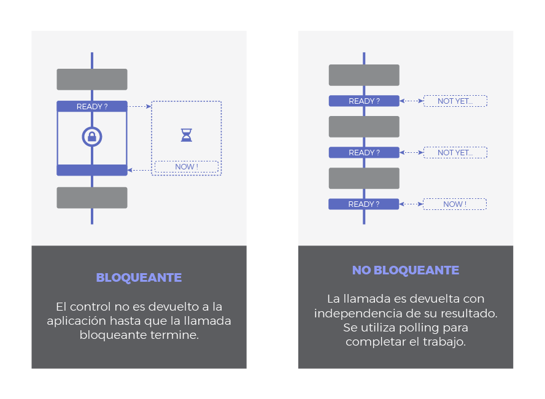
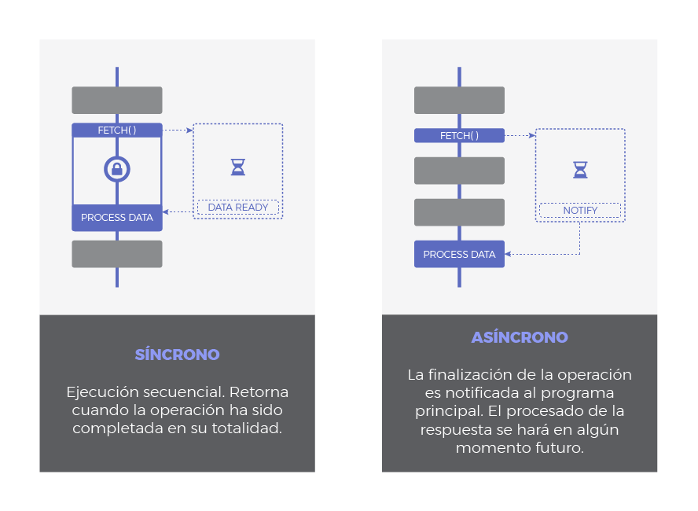
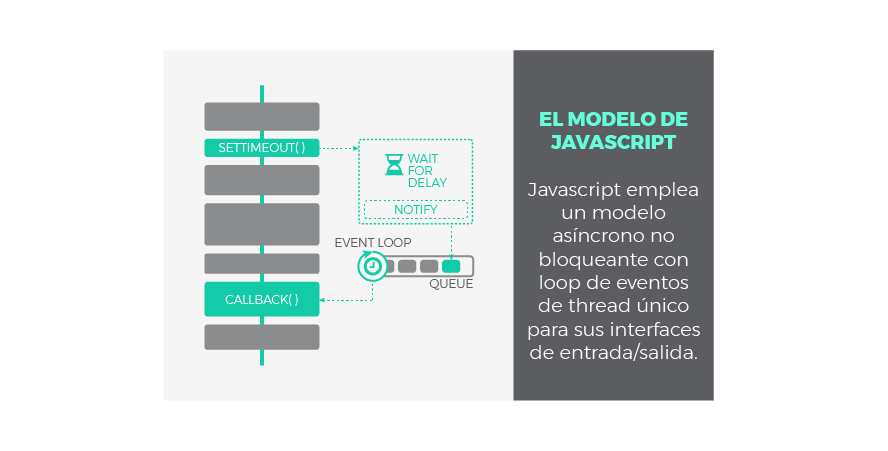
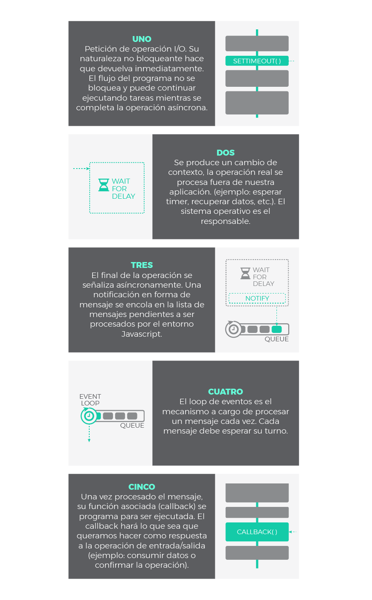
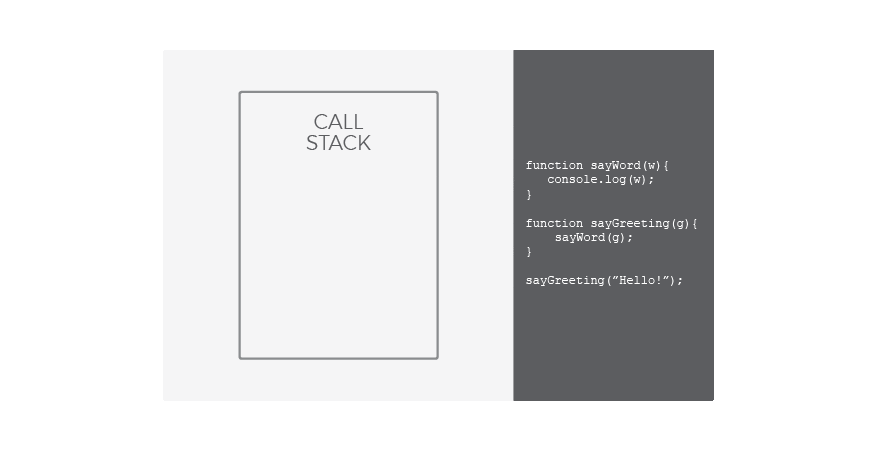
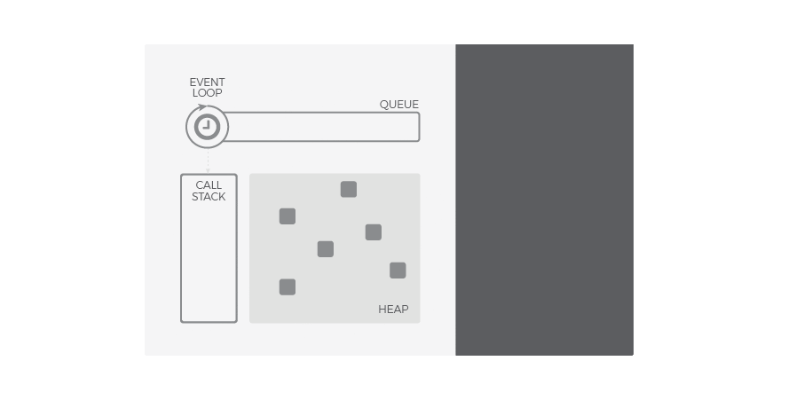
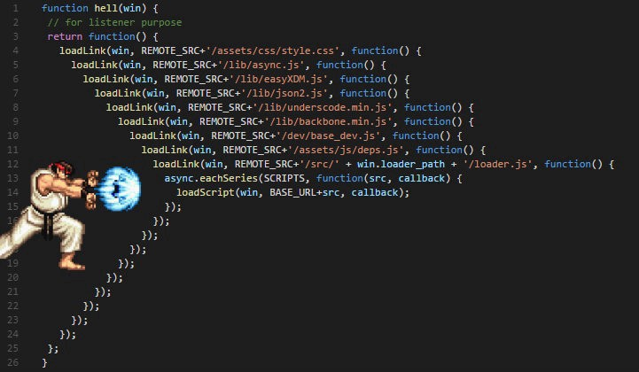

# **ASINCRONÍA**

## **Thread (Hilo)**

A process can have many threads if multi-threading is supported. JavaScript only supports a single thread, so there can only be a single sequential flow of control within a program. So how are we able to write asynchronous code that "seems" to be doing multiple things at once? The answer is that it really is not, it just may appear so. Let's learn more about some key terms related to this.

## **Concurrencia y Paralelismo**

Concurrencia y paralelismo son conceptos relacionados pero con una importante diferencia.

- **Concurrencia**: son dos o más tareas que se ejecutan _simultáneamente_
- **Paralelismo**: son dos o más tareas que se ejecutan _en el mismo instante de tiempo_

La diferencia es: que dos o más tareas se ejecuten simultáneamente no significa que sea exactamente al mismo tiempo.

_La concurrencia **no** implica necesariamente más de un thread_. El entrelazado/multiplexado, es un mecanismo para utilizar concurrencia en escenarios donde los recursos son limitados. Imaginemos un sistema operativo moderno haciendo multitarea con un único procesador: dividide las tareas en tareas más chicas y las va intercalando, de modo que cada una se ejecutará durante un breve momento, pero a nuestro parecer, todas se ejecutan a la vez.

Veamos el siguiente gráfico:



- Cuadro 1: no es ni concurrente ni paralelo. Es simplemente una ejecución secuencial, primero una tarea, después la siguiente.
- Cuadros 2, 3 y 4: son escenarios de concurrencia, con distintas técnicas:
  - Cuadro 3: concurrencia que puede conseguirse con un único thread/hilo. Porcios chicas de cada tarea se intercalan para que ambas mantengan una ejecución constante. Esto es posible solo si las tareas pueden dividirse en subtareas mas pequeñas.
  - Cuadros 2 y 4: muestran paralelismo utilizando multiples hilos, donde las tareas o subtareas corren en paralelo exactamente al mismo tiempo. A nivel de thread, el escenario 2 es secuencial, mientras que 4 es intercalado/entrelazado.


## **Operaciones CPU-Bound vs. I/O-Bound**

Los ejemplos que vimos antes, son tareas que consumen recursos de CPU. Estas tareas son un conjunto de operaciones cuy código asociado será ejecutada en nuestra aplicación. Se las conoce como operaciones limitadas por CPU (operaciones **CPU-bound**).

Sin embargo, es frecuente encontrar otro tipo de operaciones en nuestros programas, por ejemplo: leer archivos en el disco, acceder a una base de datos externa o consultar datos a través de internet. Todas estas operaciones de entrada/salida disparan pedidos especiales que son atendidas fuera del contexto de nuestra aplicación. Por ejemplo, desde nuestro programa se ordena la lectura de un archivo en disco, pero el sistema operativo y el propio disco son los involucrados en completar el pedido. Por lo tanto, las operaciones **I/O-bound** (limitadas por entrada/salida) no se ejecutan _en el dominio_ de nuestra aplicación.



Cuando decimos que una operación esta limitada por algo, se desprende que existe un cuello de botella con el recurso que la limita. De este modo, si incrementamos la potencia de nuestra CPU, mejoraremos el rendimiento de las operaciones CPU-bound, mientras que una mejora en el sistema de entrada/salida favorecerá el desempeño de las operaciones I/O-bound.

La naturaleza de las operaciones CPU-bound es intrínsecamente síncrona (o secuencial, si la CPU esta ocupada no puede ejecutar otra tarea hasta que se libere) a menos que se utilicen mecanismos de concurrencia como los vistos anteriormente (entrelazado o paralelismo por ejemplo). ¿Qué sucede con las operaciones I/O-bound? Un hecho interesante es que pueden ser asíncronas, y la asincronía es una forma muy útil de concurrencia que veremos en la siguiente sección.

## **Naturaleza I/O: Bloqueante vs. No-bloqueante && Síncrono vs. Asíncrono**

Una posible clasificación en el contexto I/O podría hacerse si imaginamos las operaciones I/O comprendidas en dos fases:

- Fase de Espera: esperamos a que el dispositivo este listo, a que la operación se complete o que los datos esten disponibles.
- Fase de Ejecución: entendida como la propia respuesta, lo que queremos hacer con los datos recibidos.

**Bloqueante vs No-bloqueante** hace referencia a como la **fase de espera** afecta a nuestro programa:

- Bloqueante: Una llamada u operación bloqueante no devuelve el control a nuestra aplicación hasta que se ha completado. Por tanto el thread queda bloqueado en estado de espera.
- No Bloqueante: Una llamada no bloqueante devuelve inmediatamente el control con independencia del resultado. En caso de que se haya completado, devolverá los datos solicitados. En caso contrario (si la operación no ha podido ser satisfecha) podría devolver un código de error indicando algo así como 'Temporalmente no disponible', 'No estoy listo' o 'En este momento la llamada sería bloqueante. Por favor, posponga la llamada'. En este caso se sobreentiende que algún tipo de polling debería hacerse para completar el trabajo o para lanzar una nueva petición más tarde, en un mejor momento.



**Síncrono vs Asíncrono** hacer referencia a cuando tendrá lugar la respuesta:

- Síncrono: es frecuente emplear 'bloqueante' y 'síncrono' como sinónimos, dando a entender que toda operación de entrada/salida se ejecuta de forma secuencial y, por tanto, debemos esperar a que se complete para procesar el resultado.
- Asíncrono: la finalización de la operación I/O se señaliza más tarde, mediante un mecanismo específico como por ejemplo un callback, una promesa o un evento, lo que hace posible que la respuesta sea procesada **en diferido**. Como se puede adivinar, su comportamiento es no bloqueante ya que la llamda I/O devuelve inmediatamente.



Según la clasificación anterior, podemos tener operaciones I/O de tipo:

- Síncronas y Bloqueantes: Toda la operación se hace de una vez, bloqueando el flujo de ejecución:
  - El thread es bloqueado mientras espera.
  - La respuesta se procesa inmediatamente después de terminar la operación.
- Síncronas y No-Bloqueantes: Similar a la anterior pero usando alguna técnica para evitar el bloqueo en la primera fase:
  - La llamada devuelve inmediatamente, el thread no se bloquea. Se necesitarán sucesivos intentos hasta completar la operación.
  - La respuesta se procesa inmediatamente después de terminar la operación.
- Asíncronas y No-Bloqueantes:
  - La petición devuelve inmediatamente para evitar el bloqueo.
  - Se envía una notificación una vez que la operación se ha completado. Es entonces cuando la función que procesará la respuesta (callback) se encola para ser ejecutada en algún momento en nuestra aplicación.


## **El Modelo de Javascript**

JavaScript fue diseñado para ser ejecutado en navegadores, trabajar con peticiones sobre la red y procesar las interacciones de usuario, al tiempo que se mantiene una interfaz fluida. Ser bloqueante o síncrono no ayudaría a conseguir estos objetivos, es por ello que JavaScript ha evolucionado intencionadamente pensando en operaciones de tipo I/O. Por esta razón:

> **JavaScript** utiliza un modelo **asíncrono y no bloqueante**, con un **loop de eventos** implementado con un único thread para sus interfaces de entrada/salida.

Gracias a esta solución, JavaScript es áltamente concurrente a pesar de emplear un único thread. Ya conocemos el significado de asíncrono y no bloqueante, pero ¿qué es el loop de eventos? Este mecanismo será explicado en el siguiente punto. Antes, a modo de repaso, veamos el aspecto de una operación I/O asíncrona en JavaScript:



Paso a paso, podría explicarse del siguiente modo:



## **El Loop de Eventos de JavaScript**

¿Cómo se ejecuta un programa en JavaScript? ¿Como gestiona nuestra aplicación de forma concurrente las respuestas a las llamadas asíncronas? Eso es exactamente lo que el modelo basado en un loop de eventos viene a responder:


- _**Call Stack**_

  Traducido, pila de llamadas, se encarga de albergar las instrucciones que deben ejecutarse. Nos indica en que punto del programa estamos, por donde vamos. Cada llamada a función de nuestra aplicación, entra a la pila generando un nuevo frame (bloque de memoria reservada para los argumentos y variables locales de dicha función). Por tanto, cuando se llama a una función, su frame es insertado arriba en la pila, cuando una función se ha completado y devuelve, su frame se saca de la pila también por arriba. El funcionamiento es LIFO: last in, first out. De este modo, las llamadas a función que están dentro de otra función contenedora son apiladas encima y serán atendidas primero.

  

- _**Heap**_

  Región de memoria libre, normalmente de gran tamaño, dedicada al alojamiento dinámico de objetos. Es compartida por todo el programa y controlada por un recolector de basura que se encarga de liberar aquello que no se necesita.

- _**Cola o Queue**_

  Cada vez que nuestro programa recibe una notificación del exterior o de otro contexto distinto al de la aplicación (como es el caso de operaciones asíncronas), el mensaje se inserta en una cola de mensajes pendientes y se registra su callback correspondiente. Recordemos que un callback era la función que se ejecutará como respuesta.

- _**Loop de Eventos**_

  Cuando la pila de llamadas (call stack) se vacía, es decir, no hay nada más que ejecutar, se procesan los mensajes de la cola. Con cada 'tick' del bucle de eventos, se procesa un nuevo mensaje. Este procesamiento consiste en llamar al callback asociado a cada mensaje lo que dará lugar a un nuevo frame en la pila de llamadas. Este frame inicial puede derivar en muchos más, todo depende del contenido del callback. Un mensaje se termina de procesar cuando la pila vuleve a estar vacía de nuevo. A este comportamiento se le conoce como 'run-to-completion'.



De esta forma, podemos entender la cola como el almacén de los mensajes (notificaciones) y sus callbacks asociados mientras que el loop de eventos es el mecanismo para despacharlos. Este mecanismo sigue un comportamiento síncrono: cada mensaje debe ser procesado de forma completa para que pueda comenzar el siguiente.

Una de las implicaciones más relevantes de este bucle de eventos es que los callbacks no serán despachados tan pronto como sean encolados, sino que deben esperar su turno. Este tiempo de espera dependerá del numero de mensajes pendientes de procesar (por delante en la cola) así como del tiempo que se tardará en cada uno de ellos. Aunque pueda parecer obvio, esto explica la razón por la cual la finalización de una operación asíncrona no puede predecirse con seguridad, sino que se atiende en modo best effort.

El loop de eventos no está libre de problemas, y podrían darse situaciones comprometidas en los siguientes casos:

- La pila de llamadas no se vacía ya que nuestra aplicación hace uso intensivo de ella. No habrá tick en el bucle de eventos y por tanto los mensajes no se procesan.
- El flujo de mensajes que se van encolando es mayor que el de mensajes procesados. Demasiados eventos a la vez.
- Un callback requiere procesamiento intensivo y acapara la pila. De nuevo bloqueamos los ticks del bucle de eventos y el resto de mensajes no se despachan.

Lo más probable es que un cuello de botella se produzca como consecuencia de una mezcla de factores. En cualquier caso, acabarían retrasando el flujo de ejecución. Y por tanto retrasando el renderizado, el procesado de eventos, etc. La experiencia de usuario se degradaría y la aplicación dejaría de responder de forma fluida. Para evitar esta situación, recuerda siempre mantener los callbacks lo más ligeros posible. En general, evita código que acapare la CPU y permite que el loop de eventos se ejecute a buen ritmo.


## **Patrones asíncronos en Javascript**

### **Callbacks**

Las callbacks son la pieza clave para que Javascript pueda funcionar de forma asíncrona. De hecho, el resto de patrones asíncronos en Javascript está basado en callbacks de un modo u otro, simplemente añaden azúcar sintáctico para trabajar con ellos más cómodamente.

Un callback no es más que una función que se pasa como argumento de otra función, y que será invocada para completar algún tipo de acción. En nuestro contexto asíncrono, un callback representa el '¿Qué quieres hacer una vez que tu operación asíncrona termine?'. Por tanto, es el trozo de código que será ejecutado una vez que una operación asíncrona notifique que ha terminado. Esta ejecución se hará en algún momento futuro, gracias al mecanismo que implementa el bucle de eventos.

Veamos en el siguiente ejemplo sencillo utilizando un callback:

```js
setTimeout(() => {
  console.log("Hola Mundo con retraso!");
}, 1000);
```

setTimeout es una función asíncrona que programa la ejecución de un callback una vez ha transcurrido, como mínimo, una determinada cantidad de tiempo (1 segundo en el ejemplo anterior). A tal fin, dispara un timer en un contexto externo y registra el callback para ser ejecutado una vez que el timer termine. En resumen, retrasa una ejecución, como mínimo, la cantidad especificada de tiempo.

Es importante comprender que, incluso si configuramos el retraso como 0ms, no significa que el callback vaya a ejecutarse inmediatamente. Vamos a ver un ejemplo:

```js
setTimeout(() => {
  console.log("Este texto debería mostrar primero");
}, 0); // el tiempo de espera es 0ms, por lo que "debería" ser instantaneo

console.log("¡Pero no!");
```

Si ejecutamos ese código en una consola, vamos a ver que aparece:

```
¡Pero no!
Este texto debería mostrar primero
```

Un callback que se añade al loop de eventos debe esperar su turno. En nuestro ejemplo, el callback del setTimeout debe esperar el primer tick. Sin embargo, la pila esta ocupada procesando la línea `console.log("¡Pero no!")`. El callback se despachará una vez que la pila quede vacía, en la práctica, cuando ¡Pero no! haya sido logueado.

**Callback Hell**

Los callbacks también pueden lanzar a su vez llamadas asíncronas, asi que pueden anidarse tanto como se desee. Inconveniente, podemos acabar con código como este:

```js
setTimeout(function(){
  console.log("Etapa 1 completada");
  setTimeout(function(){
    console.log("Etapa 2 completada");
    setTimeout(function(){
      console.log("Etapa 3 completada");
      setTimeout(function(){
        console.log("Etapa 4 completada");
        // Podríamos continuar hasta el infinito...
      }, 4000);
    }, 3000);
  }, 2000);
}, 1000);
```

Éste es uno de los inconvenientes clásicos de los callbacks, además de la indentación, resta legibilidad, dificulta su mantenimiento y añade complejidad ciclomática. Al Callback Hell también se le conoce como Pyramid of Doom o Hadouken.



[Ejercicio 1](./ejercicios/ej_01.md)


### **Promesas**

Una promesa es un objeto que representa el resultado de una operación asíncrona. Este resultado podría estar disponible ahora o en el futuro. Las promesas se basan en callbacks pero añaden un mejor manejo y sintaxis. Las promesas son especiales en términos de asincronía ya que añaden un nuevo nivel de prioridad que estudiaremos a continuación.

**Consumiendo Promesas**

Cuando llamamos a una función asíncrona implementada con este patrón, nos devolverá inmediatamente una promesa como garantía de que la operación asíncrona finalizará en algún momento, ya sea con éxito o con fallo. Una vez que tengamos el objeto promesa en nuestro poder, registramos un par de callbacks: uno para indicarle a la promesa 'que debe hacer en caso de que todo vaya bien' (resolución de la promesa o resolve) y otro para determinar 'que hacer en caso de fallo' (rechazo de la promesa o reject).

En resumen, una promesa es un objeto al que le adjuntamos callbacks, en lugar de pasarlos directamente a la función asíncrona. La forma en que registramos esos dos callbacks es mediante el método .then(resolveCallback, rejectCallback). En terminología de promesas, decimos que una promesa se resuelve con éxito (resolved) o se rechaza con fallo (rejected). Echa un vistazo al siguiente ejemplo:

```js
fetch("https://adaitw.org")
  .then(result => console.log(result), e => console.log(`Error capturado:  ${e}`));
```

En el ejemplo anterior, pedimos al servidor que nos provea una URL utilizando la función asíncrona `fetch`, y nos devuelve una promesa. Configuramos la promesa con dos callbacks: uno para resolver la promesa, que mostrará la página por consola en caso de éxito, y otro para rechazarla en caso de fallo que mostrará el error asociado.

Una característica interesante de las promesas es que pueden ser encadenadas. Esto es posible gracias a que la llamada .then() también devuelve una promesa. Esta nueva promesa devuelta será resuelta con el valor que retorne el callback de resolución original (el que hemos pasado al primer then()):

```js
fetch("https://adaitw.org")
  .then(result => {
    console.log(result);
    return "Primer Then";
  },e => console.log(`Error capturado:  ${e}`))

  .then(result => console.log(`Segundo Then despues de ${result}: La página ya ha debido ser mostrada`), e => console.log(`Error capturado:  ${e}`));
```

Para evitar verbosidad, podemos encadenar las promesas de un modo mas corto, empleando el método `.catch(rejectCallback)` para catpurar cualquier rechazo que ocurra en cualquiera de las promesas encadenadas. Solo se necesita una única sentencia catch() al final de una cadena de promesas:

```js
fetch(document.URL.toString())
  .then(result => console.log(result))
  .then(() => console.log(`Fetch completado, página mostrada`))
  .catch(e => console.log(`Error capturado:  ${e}`));
```

**Creando Promesas**

Una promesa se crea instanciando un nuevo objeto Promise. En el momento de la creación, en el constructor, debemos especificar un callback que contenga la carga de la promesa, aquello que la promesa debe hacer. Este callback nos provee de dos argumentos: resolveCallback y rejectCallback. Te suenan, ¿verdad? Son los dos mismos callbacks registrados al consumir la promesa. De este modo, depende de ti como desarrollador llamar a resolveCallback y rejectCallback cuando sea necesario para señalizar que la promesa ha sido completada con éxito o con fallo.

Una plantilla típica para la creación de promesas es la siguiente:

```js
const miFuncionAsincrona = () => {
  return new Promise((resolve, reject) => {

    // Carga de la promesa (normalmente tareas asíncronas).

    if ( /* evalúa condición */ ) {
      resolve(`Éxito!`);
    } else {
      reject(`Fallo!`);
    }
  });
}
```

Un ejemplo sencillo podría ser:

```js
const checkServer = (url) => {
  return new Promise((resolve, reject) => {
    fetch(url)
      .then(response => resolve(`Estado del Servidor: ${response.status === 200 ? "OK" : "NOT OK"}`))
      .catch(() => reject(`Error al localizar URL`));
  });
}

checkServer("https://adaitw.org")
  .then(result => console.log(result))
  .catch(e => console.log(e));
```

Las promesas son muy útiles para envolver antiguas APIs asíncronas que funcionan a través de callbacks puros. De esta forma podemos hacerlas funcionar via promesas:

```js
const delay = time => new Promise(resolveCallback => setTimeout(resolveCallback, time));

delay(3000)
  .then(() => console.log(`Este es un retardo de al menos 3 segundos`))
  .catch(() => console.log(`Retardo fallido`));
```

**Asincronía en Promesas**

Si tratásemos las promesas con la misma prioridad que el resto de mensajes asíncronos, retrasariamos innecesariamente la ejecución de sus callbacks. Podrían acabar 'perdiéndose' entre otros mensajes en la cola de eventos, como por ejemplo mensajes de renderizado o eventos de usuario. Dado que las promesas suelen ser fruto de la interacción con importantes APIs asíncronas, y por tanto, son una parte importante de la que se sirve tu aplicación, no queremos que se retrasen. Es preferible darles una prioridad mayor. El estándar ECMAScript describe el uso de una cola especial, llamada cola de microtareas o microtask queue, con una mayor prioridad dedicada a la gestión de callbacks de promesas.

La idea detrás de una segunda cola de alta prioridad es que los callbacks de cada promesa se almacenen aquí, de modo que cuando un nuevo tick del bucle de eventos tenga lugar, esta cola prioritaria será atendida primero. Asi pues, nos aseguramos que los callbacks de las promesas se ejecutarán en un futuro, si, pero lo antes posible.

Por este motivo, las trazas del siguiente ejemplo aparecen en un orden inesperado si sólo considerasemos una única cola:

```js
// LLamada asíncrona con callback puro.
setTimeout(() => console.log("1"), 0);

// LLamada asíncrona con promesa.
Promise.resolve().then(() => console.log("2"));

// 2
// 1
```

El callback de la promesa (`() => console.log("2")`) tiene mayor prioridad que el callback del setTimeout gracias a la cola de microtareas, y por ello es procesado primero.