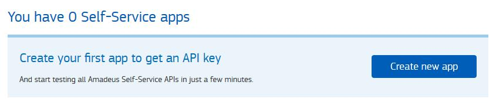
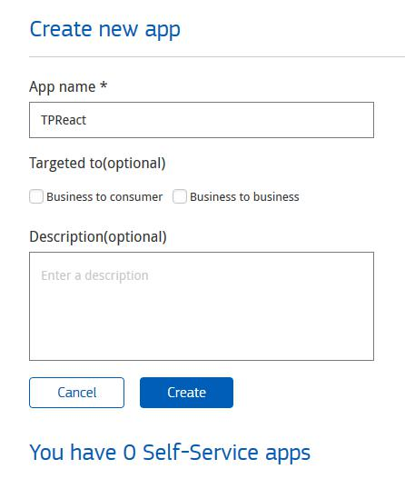
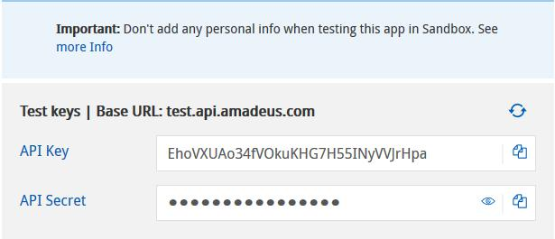

# TP Final Js - React

* Generar una página según el modelo del mockup, tanto mobile, como desktop (ejemplo real: https://screeching-field.surge.sh/).
* La API para extraer la información es: https://developers.amadeus.com/self-service/category/air/api-doc/flight-offers-search
* Para utilizar la API, es necesario crear una API Key y un API Secret.  
  1. Crear una cuenta ingresando en https://developers.amadeus.com/register
  2. Una vez creada la cuenta (luego de verificar la cuenta de email), ingresamos al perfil: https://developers.amadeus.com/my-apps
  3. Vamos a ver lo siguiente:

  4. Hacer click en el botón **Create new app**
  5. Completar los datos del formulario, y presionar el botón **Create**

  6. Una vez creada la aplicación, nos va a aparecer una pantalla con las API Keys que necesitamos:

  7. Copiamos y nos guardamos AMBOS datos, ya que los vamos a necesitar más adelante.

* Las pantallas que vamos a tener son las siguientes:
  1. Home, con formulario para la búsqueda: [Home Desktop](./vistas/desktop_1_home.png)
  2. Listado de resultados: [Resultado de búsqueda Desktop](./vistas/result.png)
  3. Detalle de un vuelo: [Checkout Desktop](./vistas/checkout.png)

## Descripción de la API
Cuando vamos a la página de resultados, necesitamos hacer el fetch a la API de Amadeus. La URL que vamos a utilizar es:  
```js
https://test.api.amadeus.com/v2/shopping/flight-offers?originLocationCode=${iataOrigin}&destinationLocationCode=${iataDest}&departureDate=${fromDate}&returnDate=${toData}&adults=${adults}&max=50
```
* **iataOrigin**: es el código de la ciudad, país o aeropuerto desde la cual viajamos, en formato IATA https://en.wikipedia.org/wiki/IATA_airport_code
* **iataDest**: es el código de la ciudad, país o aeropuerto hacia el cual viajamos, en formato IATA https://en.wikipedia.org/wiki/IATA_airport_code
* **fromDate**: es la fecha desde la que queremos viajar, y tiene que tener el formato YYYY-MM-DD
* **toDate**: es la fecha de regreso, cuando queremos comprar un vuelo de ida y vuelta, también en formato YYYY-MM-DD. Si el viaje es únicamente de ida, **no tenemos que agregar el parámetro en la URL**.
* **adults**: es la cantidad de pasajeros que van a viajar, que no pueden ser más de 8

Para utilizar esta API, vamos a necesitar crear lo que se llama access_token.  
https://medium.com/blog-apside/autorizaci%C3%B3n-con-oauth2-9b6bdfa917c0


```js
// función para transformar el objeto de datos a un FormData
const toUrlEncoded = obj => Object.keys(obj).map(k => encodeURIComponent(k) + '=' + encodeURIComponent(obj[k])).join('&');

// datos para obtener el access token
const item = {
 grant_type: 'client_credentials',
 client_id: 'API KEY',
 client_secret: 'API SECRET'
};

// hacemos el fetch a la API para solicitar el nuevo access token
fetch('https://test.api.amadeus.com/v1/security/oauth2/token', {
   method: 'post',
   headers: {
     "Content-Type": "application/x-www-form-urlencoded"
   },
   body: toUrlEncoded(item)
 })
 .then(res => res.json())
 .then(data => {
   // cuando la API nos responde, podemos guardarnos ese código que vamos a utilizarlo para hacer el fetch a la API de Amadeus
   // como este token vence cada cierto tiempo, por seguridad, siempre vamos a tener que obtener uno nuevo antes de llamar a la API
   const accessToken = data.access_token;

   // haga el pedido a la API de Amadeus para obtener unos vuelvos de ejemplo
   fetch('https://test.api.amadeus.com/v2/shopping/flight-offers?originLocationCode=SYD&destinationLocationCode=BKK&departureDate=2020-01-01&returnDate=2020-01-05&adults=2', {
       // el header es para enviarle ese token a la API
       headers: {
         'Authorization': `Bearer ${accessToken}`
       }
     })
     .then(res => res.json())
     .then(data => {
       // cuando la API nos responde, obtenemos el objeto general que tiene todos los datos
       console.log(data)
     })
 })
```
## Imágenes Aerolineas
Para las imágenes de las aerolíneas, hay que utilizar la siguiente URL: 
```js
https://content.airhex.com/content/logos/airlines_${carrierCode}_200_200_s.png
```
Donde **carrierCode** es el código de la aerolínea, provisto por la API.

## Nombre de ciudad
Para obtener el nombre de las ciudades, según el código IATA del aeropuerto, vamos a utilizar la siguiente API: 
```js
https://airports-dpvsjndcod.now.sh/city/' + iata
```
Donde **iata** es el código del aeropuerto.  
Ejemplo:  si hacemos un fetch a https://airports-dpvsjndcod.now.sh/city/EZE obtenemos el siguiente resultado:
```js
{
 "icao": "SAEZ",
 "iata": "EZE",
 "name": "Ministro Pistarini International Airport",
 "city": "Ezeiza",
 "state": "Buenos Aires",
 "country": "AR",
 "elevation": 67,
 "lat": -34.8222,
 "lon": -58.5358,
 "tz": "America/Argentina/Buenos_Aires"
}
```
Y vamos a utilizar la propiedad **state** para mostrar el nombre de la ciudad destino/origen.

### Requerimientos
* React
* SASS
* Buena organización de carpetas
* Buena tabulación del código
* Respetar el diseño propuesto
* Para los íconos se debe utilizar la librería FontAwesome: https://fontawesome.com/
### **Fuente**
```css
font-family: 'Roboto', sans-serif;
```
```html
<link href="https://fonts.googleapis.com/css?family=Roboto:300,400,500&amp;subset=cyrillic" rel="stylesheet">
```